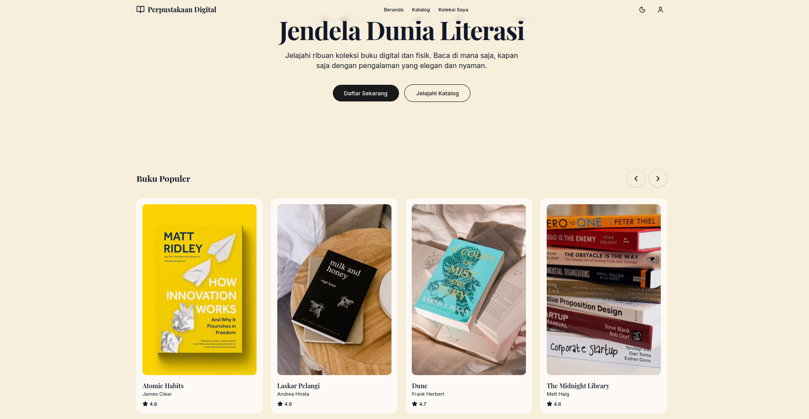
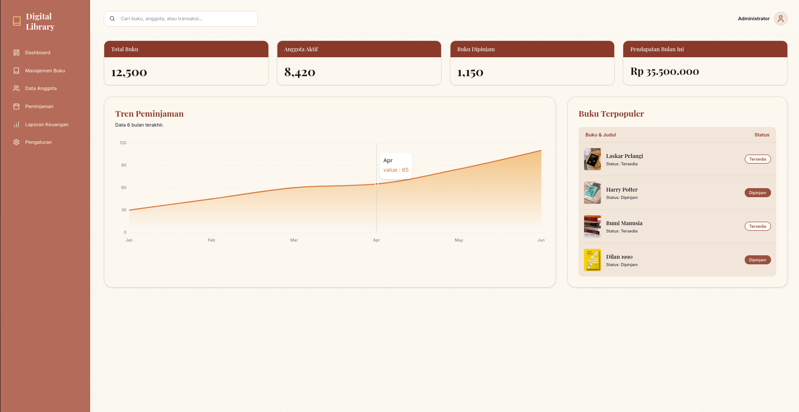

# 📚 Perpustakaan Digital (Boutique Library App)

Sistem Informasi Perpustakaan Digital modern yang mengusung tema **Warm-Elegant** (elegan & hangat). Proyek ini dirancang untuk memberikan pengalaman membaca premium layaknya berada di butik eksklusif, serta menyediakan *Dashboard Admin* yang komprehensif bagi pengelola perpustakaan.

## ✨ Fitur Utama

### 🌐 Halaman Publik & Anggota (User/Member)
- **Desain Butik Elegan**: Antarmuka modern dengan skema warna merah bata (*Terracotta*) dan krem hangat (*Warm Beige*).
- **Katalog Buku Responsif**: Pencarian dan penyaringan (*filter*) buku dengan tampilan kartu yang dinamis (termasuk efek *hover*, rating, dan *glassmorphism*).
- **Perpustakaan Pribadi (My Library)**: Navigasi lengkap menuju Buku Sedang Dibaca, Selesai Dibaca, Daftar Keinginan (*Wishlist*), dan Favorit.
- **Dukungan Dark Mode**: Peralihan instan antara *Light Mode* (tema kertas/krem) dan *Dark Mode* (hitam elegan) tanpa merusak komposisi warna aksen utama.

### ⚙️ Dashboard Admin (Administrator)
- **Tinjauan Statistik**: Panel interaktif (*Area Charts* berbasis data) untuk memantau tren peminjaman dan pendapatan secara *real-time*.
- **Manajemen Buku Terpadu**: CRUD visual (*Tambah, Edit, Hapus*) di Manajemen Katalog dengan dukungan *upload cover* buku (melalui file lokal atau URL eksternal).
- **Pencarian Global Real-time (Live Search)**: Fitur pencarian pintar berbasis *debounce* di Topbar yang secara otomatis memfilter buku (judul, penulis, atau ISBN) di berbagai halaman tanpa perlu memuat ulang halaman atau menekan tombol Enter.
- **Smart Image Scaling**: Menampilkan bentuk asli sampul buku (*landscape* maupun *portrait*) secara rapi (*object-contain*) tanpa ada bagian gambar yang gepeng (*squished*) atau terpotong (*cropped*).
- **Pengelolaan Anggota & Peminjaman**: Pelacakan status anggota (Aktif/Tidak Aktif) dan status peminjaman (Dipinjam/Terlambat/Kembali) secara instan dengan *Badge* warna informatif.
- **Konfirmasi Keamanan & UX Modern**: Menggantikan *alert native browser* yang kaku dengan animasi **Modal Konfirmasi** khusus (misalnya saat menyimpan/menghapus buku atau menonaktifkan member) serta **Notifikasi Toast** (Berhasil/Gagal) yang tampil secara dinamis.

## 🛠️ Tech Stack (Teknologi yang Digunakan)

Proyek ini menggunakan arsitektur modern (Frontend + Backend terpisah):

### Frontend (User Interface)
- **[React 18](https://react.dev/)**: Library UI utama (menggunakan Hooks modern).
- **[TypeScript](https://www.typescriptlang.org/)**: Static typing untuk kode yang lebih aman dan mudah di-maintain.
- **[Tailwind CSS v4](https://tailwindcss.com/)**: Utility-first CSS untuk styling (*custom dark mode*, *custom variants*, desain responsif).
- **[Vite](https://vitejs.dev/)**: *Build-tool* ultra cepat.
- **[React Router DOM](https://reactrouter.com/)**: Manajemen rute (*Client-side routing*) berjenjang untuk halaman publik, anggota, dan admin.
- **[Lucide React](https://lucide.dev/)**: Ikon SVG yang cantik dan konsisten.
- **[Recharts](https://recharts.org/)**: Rendering grafik (Charts) statistik interaktif di sisi admin.

### Backend (API Server)
- **[Laravel 12.x](https://laravel.com/)**: Framework PHP modern dan tangguh.
- **[PostgreSQL](https://www.postgresql.org/)**: Relational database utama untuk stabilitas.
- **[Laravel Sanctum](https://laravel.com/docs/sanctum)**: Sistem autentikasi SPA stateful yang aman.
- **RESTful API**: ~50+ endpoint API untuk mengelola perpustakaan.

## 🚀 Cara Menjalankan Secara Lokal (Local Development)

Pastikan Anda sudah menginstal **Node.js**, **PHP 8.3+**, **Composer**, dan **PostgreSQL** di komputer Anda. Ikuti langkah-langkah berikut:

1. **Kloning (Clone) Repository**
   ```bash
   git clone https://github.com/adrianfahrezi404/perpustakaan-digital.git
   cd perpustakaan-digital
   ```

2. **Setup Database (PostgreSQL)**
   ```bash
   sudo systemctl start postgresql
   sudo -u postgres psql -c "CREATE DATABASE perpustakaan_digital;"
   sudo -u postgres psql -c "ALTER USER postgres PASSWORD 'password';"
   ```

3. **Jalankan Backend (Laravel)**
   Buka terminal baru:
   ```bash
   cd backend
   composer install
   cp .env.example .env
   php artisan key:generate
   php artisan storage:link
   php artisan migrate:fresh --seed
   php artisan serve
   ```
   *Server berjalan di `http://127.0.0.1:8000`*

4. **Jalankan Frontend (React/Vite)**
   Buka terminal baru:
   ```bash
   cd frontend
   npm install
   npm run dev
   ```
   *Aplikasi dapat diakses di `http://localhost:5173`*

---

## 🎨 Cuplikan Tampilan (Screenshots)

**Halaman Utama (Landing Page)**:
  
  

**Dashboard Admin**:

  

## 📝 Status Pengembangan
- [x] **Fase 1: Desain Frontend UI/UX (Selesai)**
- [x] **Fase 2: Pembuatan Backend & REST API (Selesai)**
- [x] **Fase 3: Autentikasi Keamanan & Integrasi API (Selesai)**
- [x] **Fase 4: Integrasi Halaman Frontend dengan Backend API (Selesai)**
- [ ] **Fase 5: Sistem Peminjaman & Pengembalian (Loan Management)**
- [ ] **Fase 6: Halaman Profil Anggota & Histori Peminjaman (Member Area)**
- [ ] **Fase 7: Integrasi Pembaca PDF (Web PDF Reader)**
- [ ] **Fase 8: Fitur Interaksi (Ulasan, Rating & Sistem Notifikasi)**
- [ ] **Fase 9: Ekspor Laporan Data (PDF/Excel) untuk Admin**

<br/>
<div align="center">
  Dibuat dengan ❤️ untuk pengalaman literasi digital terbaik.
</div>
